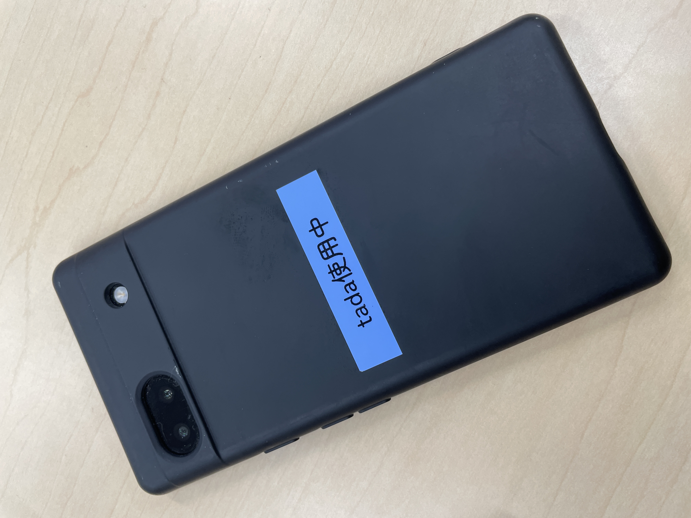
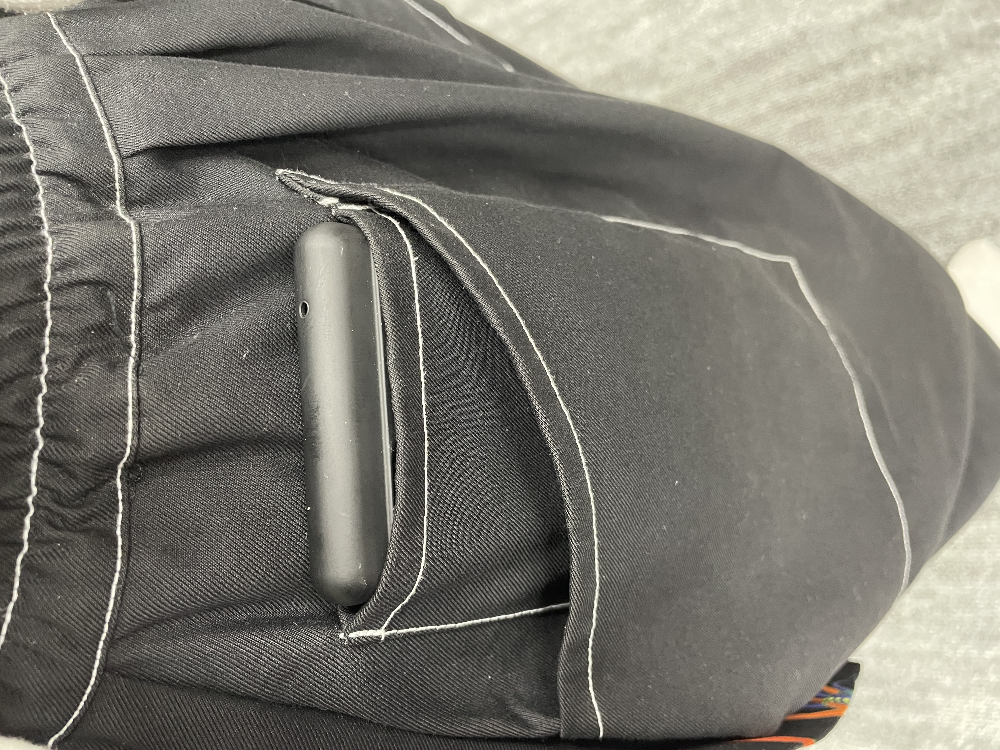

# kajilab-ActivityRecognition
## セットアップ
仮想環境の作成
```bash
python -m venv venv
source venv/bin/activate
```

依存関係のインストール
```bash
pip install -r requirements.txt
```

## 実験について
### 使用端末
Pixcel 6a



### センシング方法
- ポケットに入れた
  - あえてポーチを使わずにやや揺れるポケットに入れた
  - ポケットはスマホがピッタり入るサイズ
- y軸正が鉛直上向き
- z軸正が内向き


